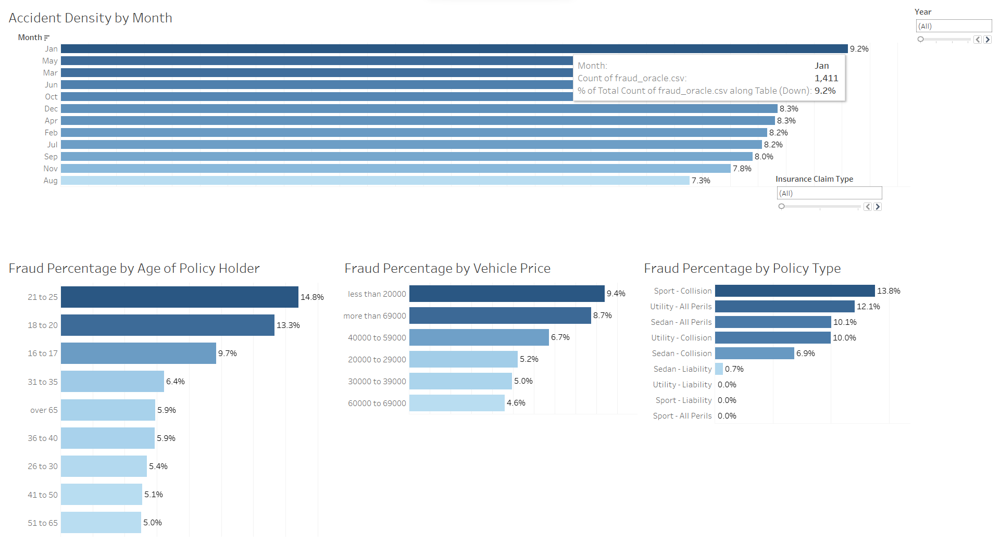

# Virtual Machine (VM) Exercises

## :information_source: Read this before getting started
- The goal of exercises in case study is for learners to apply what was learned in the previous courses to new problems or situations. This is best pedagogical practice for retaining and building skills.
- We can only run free versions of BI software in our virtual machine exercises. In the case of Power BI, make sure the exercises can run on [Power BI Desktop](https://powerbi.microsoft.com/en-us/desktop/) without any additional paid products. 
- Unsure what the scope of an exercise should be? Here's an [example](https://campus.datacamp.com/courses/case-study-analyzing-customer-churn-in-tableau/exploratory-analysis-1?ex=4) from the Case Study: Analyzing Customer Churn in Tableau. The first chapter of most DataCamp courses are free, so take a look at our [BI courses](https://learn.datacamp.com/courses?technologies=Tableau&technologies=Power%20BI) to get a feel for how we assess and guide learners in **case studies**.

## 1st VM Exercise

#### Dataset

- [x] Add datasets used to the `datasets/` folder
- The dataset for this case study is Vehicle Insurance Fraud Data that can be found in the datasets folder

#### Files

- [x] **Initial**: Add file to the `exercises/`  folder with the name `ex-1-intial.twbx` or `ex-1-intial.pbix`, depending if you are auditioning for a Tableau or Power BI course.
- The initial file in the exercises folder includes the initial Tableau workbook outlining some basic Exploratory Data Analysis (EDA).

- [x] **Solution**: Add file to the `exercises/`  folder with the name `ex-1-sol.twbx` or `ex-1-sol.pbix`
- The solution file includes difference Distributions that give the reader insights into different variables and their assorted relevance to the target variable which in this case is "FraudFound P"

#### Learning Objective

*One measurable learning objective that this exercise assesses*

The learning objective of this exercise is to ensure that the learner has developed an initial understanding of how an Exploratory Data Analysis is carried out after importing the data in Tableau. This can be broken down into sub-objectives:
- Developing an understanding of distribution of fraud by different variables such as (Policy Type, Vehicle Price, Age of Policy Holder etc.) 
- Understanding how Calculated Fields in Tableau can be used to introduce new insights
- Applying appropriate filters and creating groups to view breakdown of insurance fraud

#### Context

*3 - 4 sentence description of why it’s important to to do this task (linking back to the learning objective). Explain how this would be used in a real-life situation. Why is it useful, what problem does it solve?*
You can look at the same [exercise]([url](https://campus.datacamp.com/courses/case-study-analyzing-customer-churn-in-tableau/exploratory-analysis-1?ex=4)) from the Case Study: Analyzing Customer Churn in Tableau on how to write a good context.

The initial step of any analysis starts by importing a raw dataset and exploring a few variables that will help us identify hidden patterns with the target variable; in this case "FraudFound". For finding that, we shall use some in-built functionalities of Tableau including Groups, Filters and Calculated Fields. With the use of these functionalities and conducting analyses on a few demographic variables such as Policy Type, Vehicle Price, Age of Policy Holder - the learner will be able to identify key trends, types of anomalies and develop a practical understanding to approach a business problem related to Fraudulent or Anomalous Transactions. As such problems are prone to datasets where class imbalance is quite frequent, this Exploratory Data Analysis offers analytical principles to conduct a more complete report.
#### Steps to be executed by the student (max 6)

*Each bulleted instruction is a complete sentence that describes a specific task.*

- Load the CSV file "fraud_oracle.csv" placed in the dataset folder  
- Create a group using the target variable (*FraudFound P*) with 1 as Fraudulent Claim and 0 as Valid Claim
- Create calculated field called Fraud Percentage showing the percentage of fraudulent claims out of all reported accidents
- Identify Accident Percentage by Month and add the Group as a filter.  
- Check the distribution of fraud by count and Fraud Percentage (Calculated Field) for Policy Type, Vehicle Price, and Age of Policy Holder
- Create a filter for the year of the accident to every worksheet and apply Tableau actions

#### Exercise question:
*This is a question presented to learners to check if the steps above were properly completed. It can be a multiple choice question or a question with a 1-3 word answer. It is often not possible to check if all the steps are completed, in this case; the priority is to check that the learner meets the learning objective.*
Adding in multiple as there 
- Which Age Bracket had the highest percentage of Fraudulent Claims in the year 1994?
- Which month accounted for the lowest amount of Fradulent Claims across all three years?
- What is the optimal vehicle price bracket to ensure lower chances of insurance fraud?
- Which policy type is the riskiest from the business perspective when factoring in insurance fraud?

#### End goal:

*Add an image of the final visualization here.*

## Finalized Workbook

#### Files
You can upload your final workbook in the exercises folder as `ex-final-sol.twbx` or `ex-final-sol.pbix`.

#### Explanation & Description
Which answers will the learner be able to solve once building this? How does it fit in the bigger picture?

The learner will be able to independently evaluate a Fraud Evaluation problem by evaluating multiple variables and would be able to give keen insights to the stakeholders ; ultimately adding a positive impact to the bottomline of the business through data-driven decision making. 

#### End goal:

*Add an image of the final visualization here.*

